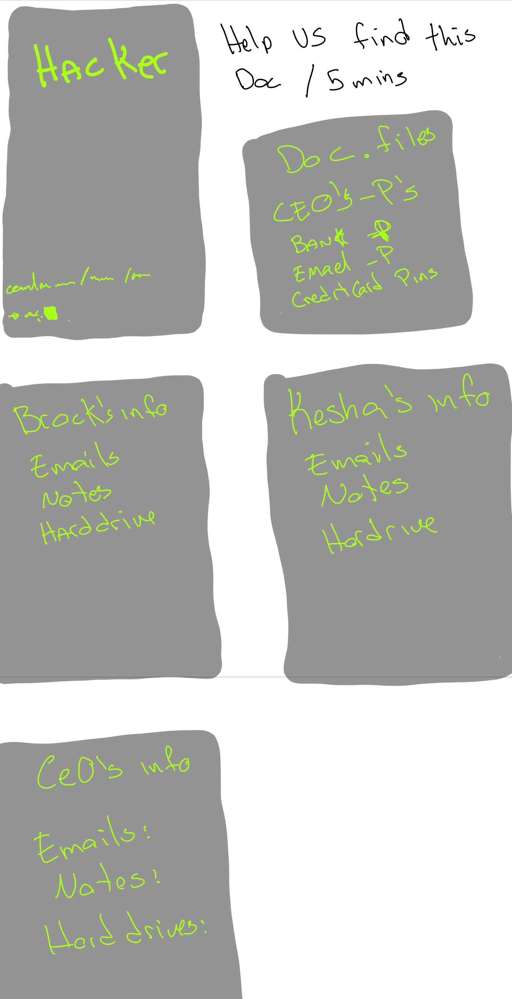

GA hacker

Ever wanted to be a hacker? Hack your way into the heart of a mysterious organization to uncover their secrets. GA Hacker is a game which uses command prompts that simulate an operating system. Learn the commands of each system to help you navigate through your adventure.

As you hack into their systems, you will learn about the people who work there. Read emails and notes to find clues and riddles which will give you access to more accounts. You may also discover dirty little secrets about the employees as well.

Hacking into new accounts or discovering key information will increase your skill level. As you achieve your goals, you will move closer and closer to the final achievement.

Wireframe

Tools used : HTML, CSS, JavaScript

Bugs and missing features:
  - increase variable structure
  - terminal command path needs to be fixed for each section.
  - add animations
  - add skills level
  - add timer
 
